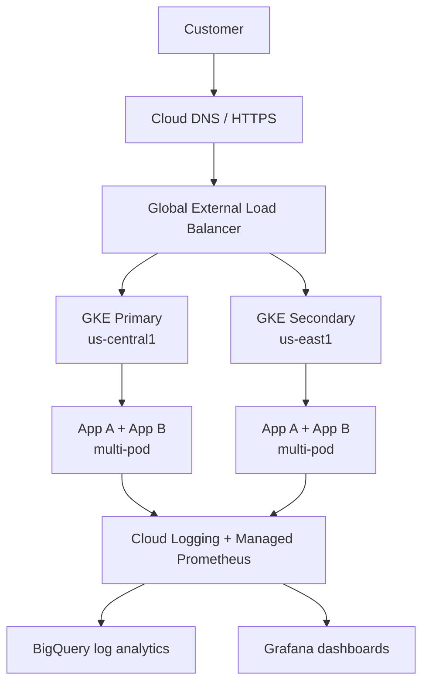

# Charles Schwab — GCP/GKE Senior SRE Open-Book Assessment

Reproducible two-region GKE platform running two multi-pod web applications with centralized logging, BigQuery analysis, Managed Service for Prometheus, and a portable Grafana dashboard.

> **Candidate:** Jyothi Thatiparti  
> **Scope note:** This repository contains deployable infrastructure and evidence templates. Screenshots and endpoint values must be captured from the candidate's own GCP project after deployment. Costly enterprise capabilities are designed and documented, but disabled by default.

## Assessment deliverables

| Requirement | Repository evidence | Runtime evidence to add |
|---|---|---|
| Working clusters | `terraform/`, `kubernetes/` | `docs/screenshots/01-clusters.png` |
| Accessible application endpoints | Services and optional Ingress manifests | `02-app-a.png`, `03-app-b.png`, URLs in `docs/evidence.md` |
| Multiple pods | Deployments use 3 replicas plus HPA | `04-workloads.png` |
| Grafana dashboard | `observability/grafana/sre-dashboard.json` | `05-grafana-dashboard.png` |
| BigQuery log analysis | Four queries in `observability/bigquery/` | `06-bigquery-results.png` |
| Troubleshooting scenario | `docs/troubleshooting.md` | Commands/output captured during test |
| Architecture and rationale | `docs/architecture.md`, `docs/design-decisions.md` | N/A |

## Architecture



The default deployment exposes each application through a regional `LoadBalancer` service so the assignment can be demonstrated without Multi-Cluster Ingress licensing/configuration. The production design replaces those services with a single global HTTPS load balancer backed by standalone NEGs or Multi-Cluster Gateway/Ingress.

## Quick start

### Prerequisites

- A GCP project with billing enabled and sufficient GKE quota
- `gcloud`, `terraform >= 1.6`, `kubectl`, and Docker
- Project Owner for a sandbox, or the narrower roles listed in `docs/setup-guide.md`

```bash
gcloud auth application-default login
gcloud auth login
gcloud config set project YOUR_PROJECT_ID
```

### 1. Provision infrastructure

```bash
cd terraform
cp terraform.tfvars.example terraform.tfvars
# Edit project_id and billing-safe settings.
terraform init
terraform validate
terraform plan -out=tfplan
terraform apply tfplan
```

### 2. Build and publish images

```bash
export PROJECT_ID="YOUR_PROJECT_ID"
export REGION="us-central1"
gcloud auth configure-docker "${REGION}-docker.pkg.dev"
docker build -t "${REGION}-docker.pkg.dev/${PROJECT_ID}/sre-apps/app-a:1.0.0" applications/app-a
docker build -t "${REGION}-docker.pkg.dev/${PROJECT_ID}/sre-apps/app-b:1.0.0" applications/app-b
docker push "${REGION}-docker.pkg.dev/${PROJECT_ID}/sre-apps/app-a:1.0.0"
docker push "${REGION}-docker.pkg.dev/${PROJECT_ID}/sre-apps/app-b:1.0.0"
```

### 3. Deploy to both clusters

```bash
PROJECT_ID="YOUR_PROJECT_ID" ./scripts/deploy.sh
./scripts/validate.sh
```

### 4. Generate traffic and inspect

Use the external IPs printed by `validate.sh`:

```bash
curl "http://APP_A_EXTERNAL_IP/"
curl "http://APP_B_EXTERNAL_IP/"
curl "http://APP_A_EXTERNAL_IP/work?delay_ms=250"
curl "http://APP_A_EXTERNAL_IP/error"
```

Allow several minutes for log routing and metrics ingestion. Run the SQL files after replacing `YOUR_PROJECT_ID`, and import the Grafana dashboard JSON after configuring the Google Cloud Monitoring data source.

## Validation and evidence

Follow `docs/evidence.md` exactly. It includes commands for cluster health, replica count, endpoint HTTP status, HPA, Cloud Logging, BigQuery, and Grafana. Add only authentic screenshots from the deployed environment.

## Cost and cleanup

Two regional GKE clusters and load balancers incur charges. The example defaults to small, single-zone node locations within two regions while preserving the two-cluster design. Review `terraform plan` before applying and run:

```bash
./scripts/destroy.sh
```

## Repository map

| Directory | Purpose |
|---|---|
| `terraform/` | Network, NAT, Artifact Registry, GKE, BigQuery, log sink and monitoring |
| `applications/` | Two lightweight Python web services with structured logs and Prometheus metrics |
| `kubernetes/` | Namespace, deployments, services, HPA and PodMonitoring |
| `observability/` | BigQuery SQL, Grafana dashboard, and logging guidance |
| `docs/` | Architecture, setup, decisions, security, evidence and incident RCA |
| `scripts/` | Repeatable deploy, validation and teardown helpers |

## Implemented vs. production design

| Capability | Default | Production recommendation |
|---|---|---|
| Two GKE clusters | Implemented | Regional/private clusters with larger node pools |
| Two apps, multi-pod | Implemented | Add PDBs, topology spread and progressive delivery |
| Regional endpoints | Implemented | Global HTTPS LB + MCI/MCS or Gateway API |
| Logging to BigQuery | Implemented | Partitioned log views, retention and SIEM routing |
| Managed Prometheus | Implemented | SLO alerts and long-term dashboard governance |
| Cloud Armor / ASM / Binary Authorization | Documented, off | Enable under enterprise policy and budget |

