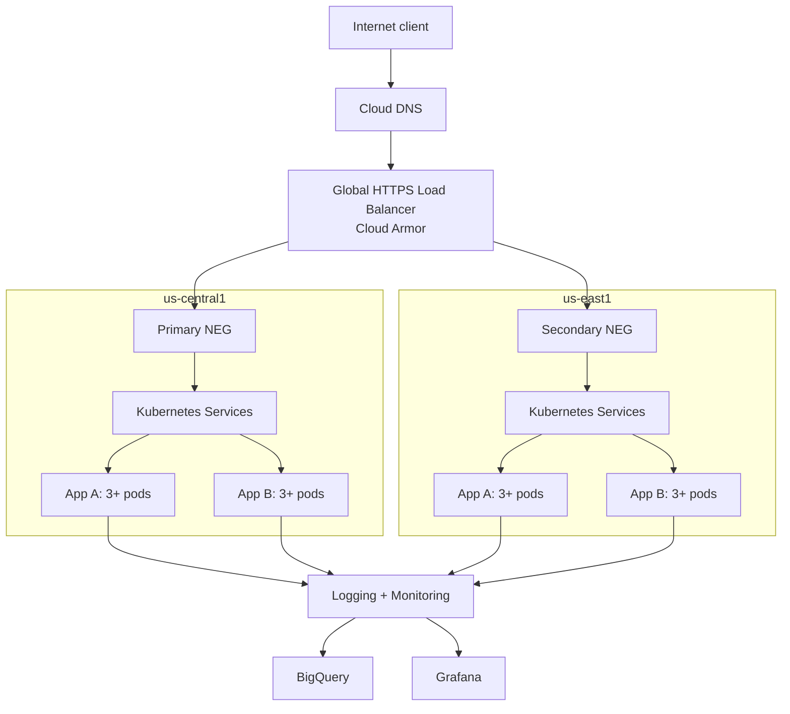

# Architecture

## Logical view

## Request flow

1. Cloud DNS resolves the application name to a global anycast IP.
2. The external HTTPS load balancer terminates TLS and applies Cloud Armor policy.
3. Health-aware routing selects the closest healthy cluster backend.
4. The cluster service balances the request across Ready pod endpoints.
5. Readiness probes prevent unhealthy pods from receiving traffic; rolling-update settings retain capacity during releases.
6. The response returns through the same edge path. Application logs and Prometheus metrics are collected asynchronously.

## Assessment implementation

To keep the environment reproducible without enterprise fleet/MCI dependencies, the default manifests create one external service per app per cluster. This yields four testable endpoints. The production evolution is a single global HTTPS endpoint using Multi-Cluster Gateway/Ingress or standalone NEGs.

## Availability model

- Application: three replicas, readiness/liveness probes, HPA and PDB in each cluster.
- Cluster: two failure domains and symmetrical configuration.
- Traffic: global health checking and failover in the target production design.
- State: apps are stateless; persistent state belongs in managed multi-region services with tested backup/restore.
- Operations: structured logs, golden-signal metrics, alerting and runbooks.

